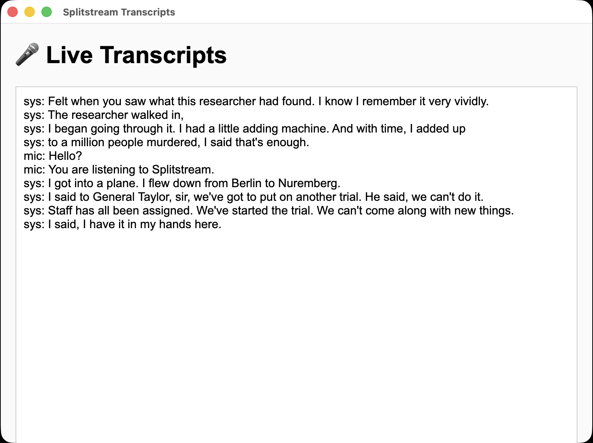

# 🎙️ Splitstream + Electron Starter App



Splitstream is an audio capture SDK for macOS that records system and microphone audio simultaneously for transcription. This starter app shows how to use it within an Electron environment.

It includes:
- A Node-based **main process** that runs Splitstream.
- A **preload script** that safely exposes APIs to the renderer.
- A **simple renderer** that displays live transcripts.

---

## 🧩 Prerequisites

Before running this project, make sure you have:

1. **MacOS** 14.2 or above
2. **Node.js v18** or above
3. A valid **Splitstream API Key**
4. A valid **Deepgram API Key**

---

## ⚙️ Setup

### 1. Clone the Repository

```bash
git clone https://github.com/sam-brainstream/electron-splitstream-starter.git
cd electron-splitstream-starter
```

### 2. Install Dependencies

```bash
npm install
```

### 3. Create a `.env` File

In the root directory, create a file named `.env` and add your API keys:

```
DEEPGRAM_API_KEY=your_deepgram_api_key_here
SPLITSTREAM_API_KEY=your_splitstream_api_key_here
```

> These values are automatically loaded into `process.env` using `dotenv` inside `main.js`.

### 4. Start the Electron app.

Run the following command in your Terminal to start the Electron app.

`npm run start`

---

## 🪄 How It Works

### 🧩 main.js
Initializes Electron, loads the `.env` variables, and starts Splitstream when the window finishes loading.

```js
import { createSplitstream } from 'splitstream-node'
```

- Streams audio from your Mac’s input/output.
- Sends real-time transcripts from Deepgram.
- Emits `transcript` events to the renderer.

### 🧩 preload.js
Safely exposes a listener to the renderer via Electron’s `contextBridge`:

```js
contextBridge.exposeInMainWorld('electronAPI', {
  onTranscript: (callback) => ipcRenderer.on('transcript', (_event, value) => callback(value))
})
```

### 🧩 renderer.js
Listens for transcripts and adds them to the DOM:

```js
window.electronAPI.onTranscript((text) => {
  const line = document.createElement('div')
  line.textContent = text
  container.appendChild(line)
  container.scrollTop = container.scrollHeight
})
```

---

## 🖥️ Running the App

Once your `.env` file is configured:

```bash
npm start
```

You should see:
- An Electron window open.
- Splitstream start logging transcripts to both the console and the app window.
- After 60 seconds, it automatically stops recording.

---

## 🧩 Environment Variables

| Variable | Description | Required |
|-----------|--------------|-----------|
| `DEEPGRAM_API_KEY` | Your Deepgram transcription API key | ✅ |
| `SPLITSTREAM_API_KEY` | Your Splitstream API key | ✅ |
| `ENV` | Optional, defaults to `production` | ❌ |

---

## 🧼 Troubleshooting

- **No transcripts showing?**
  - Verify your `.env` keys are valid.
  - Check the terminal output for “Missing environment variables”.
  - Make sure your microphone permissions are granted to Electron (System Settings → Privacy & Security → Microphone).

- **Permission errors?**
  - On macOS, you may need to approve microphone or screen recording access for Electron.

- **Still stuck?**
  - Run `console.log(process.env)` inside `main.js` to confirm your keys are loading.

---

## 🧾 License

This project is provided for demonstration purposes.  
Splitstream is proprietary software owned by the author — licensing terms apply.

---

## 💡 Next Steps

You can extend this starter app to:
- Display multiple channels of audio separately.
- Log transcripts to a file or database.
- Add VAD (voice activity detection) or custom keyword triggers.
- Integrate with a real-time chat overlay or UI dashboard.
