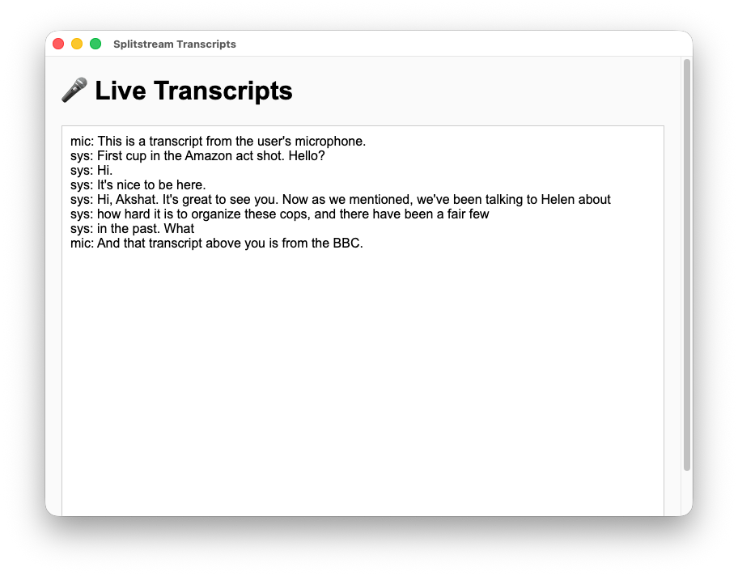
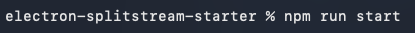

# 🎙️ Splitstream + Electron Starter App



Splitstream is an audio capture SDK for macOS that records system and microphone audio simultaneously for transcription. This starter app shows how to use it within an Electron environment.

---

## 🧩 Prerequisites

Before running this project, make sure you have:

1. **MacOS** 14.2 or above
2. **Node.js v18** or above
3. A valid **Splitstream API Key**
4. A valid **Deepgram API Key**

---

## ⚙️ Setup

### 1. Clone the Repository

```bash
git clone https://github.com/sam-brainstream/electron-splitstream-starter.git
cd electron-splitstream-starter
```

### 2. Install Dependencies

```bash
npm install
```

### 3. Create a `.env` File

In the root directory, create a file named `.env` and add your API keys as environment variables:

```bash
DEEPGRAM_API_KEY="your_deepgram_api_key_here"
SPLITSTREAM_API_KEY="your_splitstream_api_key_here"
```

> These values are automatically loaded into `main.js`, but _if by chance you run_ `npm run build`, you'll have to replace the `process.env` in `main.js` and manually define them instead.

### 4. Start the Electron app.

Run the following command in your Terminal to start the Electron app.

`npm run start`

⚠️ #### **Permissions Warning**

_If you are running_ `npm run start` inside of VSCode, **the system transcripts will not show up unless you manually give VSCode permission!**

To avoid this problem, simply run the application inside of your Terminal:



---

## 🪄 How It Works

### 🧩 main.js

Initializes Electron, loads the `.env` variables, and starts Splitstream when the window finishes loading.

```js
import { createSplitstream } from "splitstream-node";
```

- Streams audio from your Mac’s input/output.
- Sends real-time transcripts from Deepgram.
- Emits `transcript` events to the renderer.

### 🧩 preload.js

Safely exposes a listener to the renderer via Electron’s `contextBridge`:

```js
contextBridge.exposeInMainWorld("electronAPI", {
  onTranscript: (callback) =>
    ipcRenderer.on("transcript", (_event, value) => callback(value)),
});
```

### 🧩 renderer.js

Listens for transcripts and adds them to the DOM:

```js
window.electronAPI.onTranscript((text) => {
  const line = document.createElement("div");
  line.textContent = text;
  container.appendChild(line);
  container.scrollTop = container.scrollHeight;
});
```

---

## 🧼 Troubleshooting

- **No transcripts showing?**

  - Verify your `.env` keys are valid.
  - Check the terminal output for “Missing environment variables”.
  - Make sure you're running it in **your Terminal**, not VSCode's integrated terminal.

---

## 🧾 License

This project is provided for demonstration purposes.  
Splitstream is proprietary software owned by the author — licensing terms apply.
